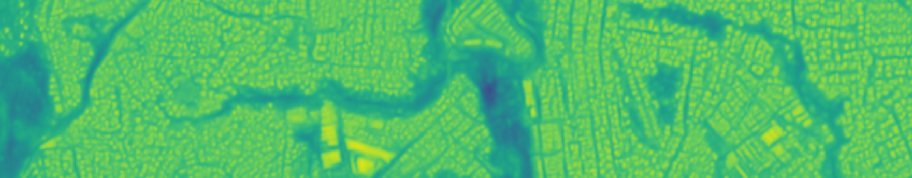
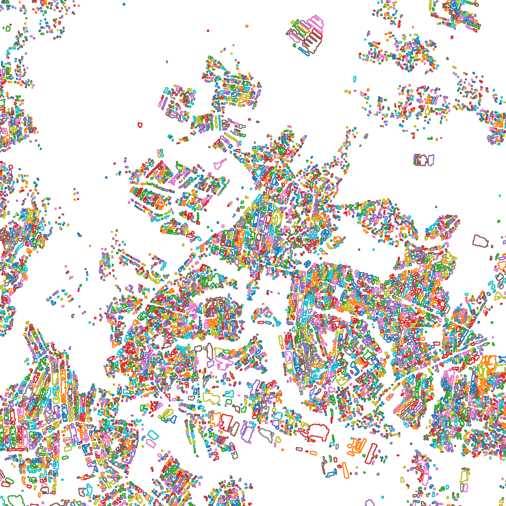
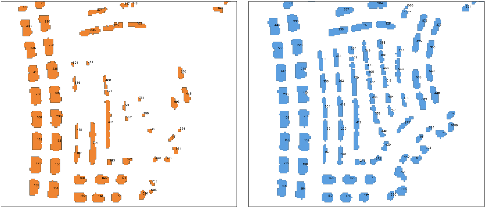

#  The SpaceNet 7 Baseline Algorithm 

The [SpaceNet 7](https://spacenet.ai/sn7-challenge/) dataset contains ~100 data cubes of monthly Planet 4 meter resolution satellite imagery taken over a two year time span, with attendant building footprint labels.  The goal of the SpaceNet 7 Challenge is to identify and track building footprints and unique identifiers through the multiple seasons and conditions of the dataset.  

To address this problem we propose the SpaceNet 7 Baseline algorithm.  This algorithm is a multi-step process that refines a deep learning segmentation model prediction mask into building footprint polygons, and then matches building identifiers (i.e. addresses) between time steps. See [The DownLinQ](https://medium.com/the-downlinq/the-spacenet-7-multi-temporal-urban-development-challenge-algorithmic-baseline-4515ec9bd9fe) for further details.  While the goal is akin to traditional video object tracking, the semi-static nature of building footprints and extremely small size of the objects introduces unique challenges. 

There are a few steps required to run the algorithm, as detailed below.

-----------
I. Download Data and Create Environment

1. Download SpaceNet 7 Data
    
    The SpaceNet data is freely available on AWS, and all you need is an AWS account and the [AWS CLI](https://aws.amazon.com/cli/) [installed](https://docs.aws.amazon.com/cli/latest/userguide/cli-chap-install.html) and [configured](https://docs.aws.amazon.com/cli/latest/userguide/cli-chap-configure.html). Once you’ve done that, simply run the command below to download the training dataset to your working directory (e.g. `/local_data/sn7/aws_download/`):
   
        cd /local_data/sn7/aws_download/
        aws s3 cp s3://spacenet-dataset/spacenet/SN7_buildings/tarballs/SN7_buildings_train.tar.gz .
        aws s3 cp s3://spacenet-dataset/spacenet/SN7_buildings/tarballs/SN7_buildings_test_public.tar.gz .

    Extract data from the tarballs:
    
         cd /local_data/sn7/aws_download/
         tar -xvf SN7_buildings_train.tar.gz
         tar -xvf SN7_buildings_test_public.tar.gz

2. Download SpaceNet 7 baseline code to the desired location (e.g. `/path_to_baseline/`):
    
        cd /path_to_baseline/
        git clone https://github...
 
 
3. Build and launch the docker container, which relies upon [Solaris](https://solaris.readthedocs.io/en/latest/) (a GPU-enabled machine and [nvidia-docker](https://github.com/NVIDIA/nvidia-docker) are recommended):

        nvidia-docker build -t sn7_baseline_image /path_to_baseline/docker 
        NV_GPU=0 nvidia-docker run -it -v /local_data:/local_data  -ti --ipc=host --name sn7_gpu0 sn7_baseline_image
        conda activate solaris
       
4. Execute commands

    1. Either use the jupyter notebook:
    
            cd /path_to_baseline/
            jupyter notebook --ip 0.0.0.0 --port=9111 --no-browser --allow-root &
    
        Locally in your browser, visit:
    
            http://localhost:9111
        
    
    2. Or simply copy the relevant commands into a terminal within the docker container
    

-------
II. Prepare the data for training and inference (see `notebooks/sn7_data_prep.ipynb`)

-------
III. Train (see `notebooks/sn7_baseline.ipynb`, or use the pretrained weights in `models`

-------
IV. Infer (see `notebooks/sn7_baseline.ipynb`)

Output will consist of:

1. Inference masks:

2. Building footprints:

3. Building footprints matched by ID across the data cube:

